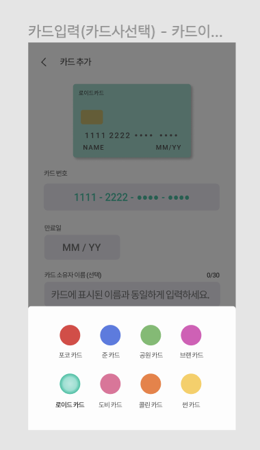
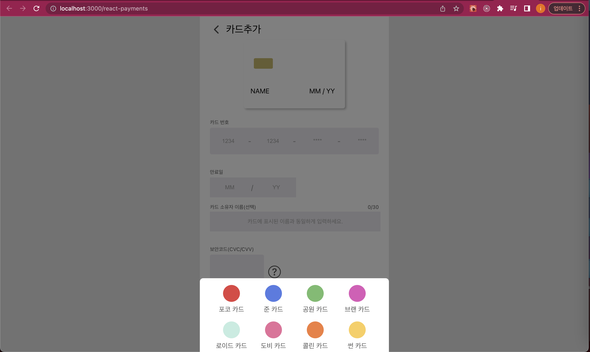
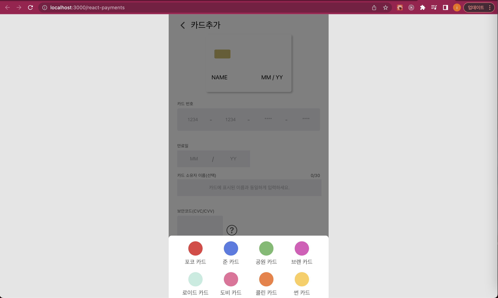
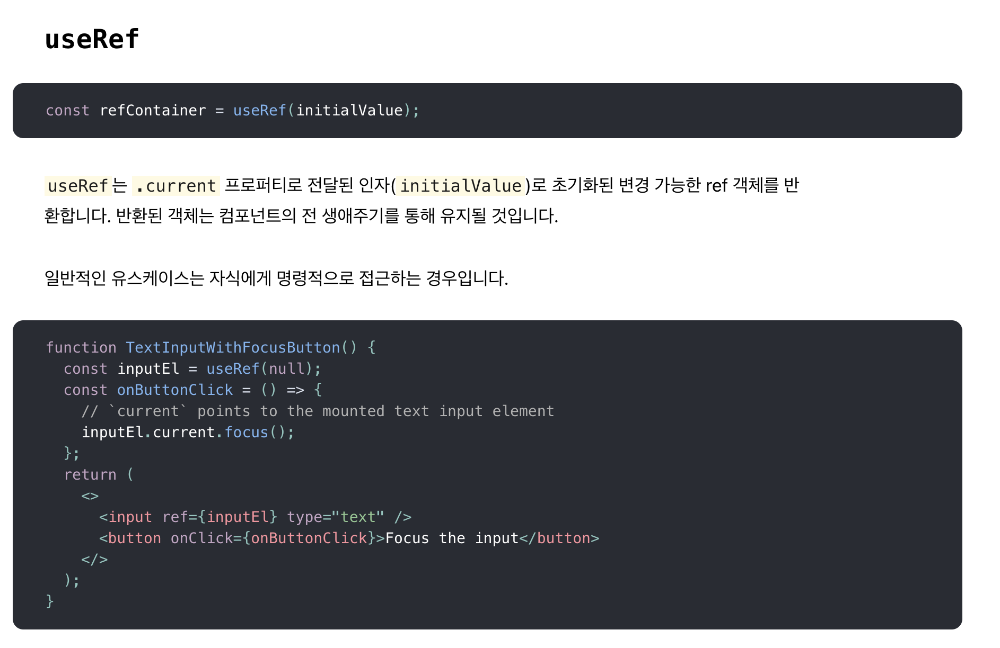
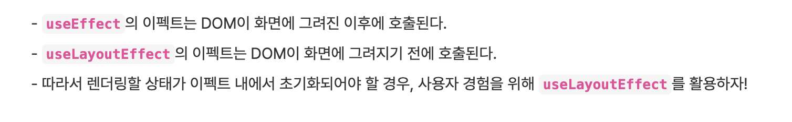
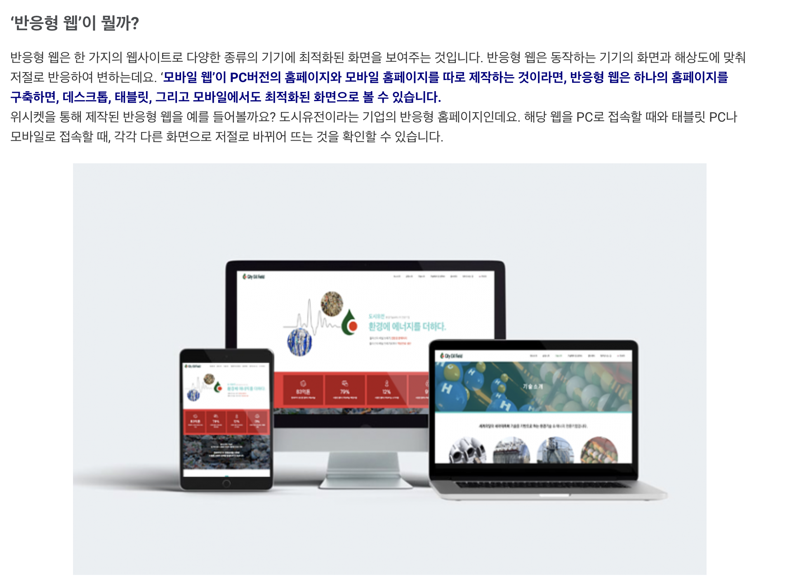

# react 모달창 만들기

## 디자인 시안

## 문제 발생

## 원하는 모습

---

# 해결책

---

# 반응형 웹이란?

디스플레이의 종류에 따라 화면의 크기가 자동으로 최적화되도록 조절되는 웹페이지를 말합니다. 쉽게 풀자면 한 개의 홈페이지로 PC와 모바일에서 같이 쓸 수 있는 것을 말합니다.

---

# 참조

[useRef docs](https://ko.reactjs.org/docs/hooks-reference.html#uselayouteffect)

[useLayoutEffect 훅에 관해서](https://merrily-code.tistory.com/46)

[useLayoutEffect hook docs](https://ko.reactjs.org/docs/hooks-reference.html#uselayouteffect)

[CSS 부모의 opacity를 자식에게 적용하지 않는법 - 1](https://blogofpjj.tistory.com/32)

[CSS 부모의 opacity를 자식에게 적용하지 않는법 - 2](https://codingbroker.tistory.com/58)
