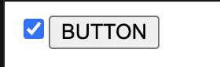

## 문제상황

checkbox를 제어 컴포넌트로 사용하는 도중 다음과 같은 에러를 만났다.

```
Warning: You provided a `checked` prop to a form field without an `onChange` handler. This will render a read-only field. If the field should be mutable use `defaultChecked`. Otherwise, set either `onChange` or `readOnly`.
```

해석을 해보자면,

"너 지금 onChange handler없이 checked prop을 넘겨줬는데, 이러면 input을 **read-only**로 만들어 버려."

1. input이 상태값에 따라 바뀌길 원하면 onChange를 넣던지 (제어 컴포넌트)
2. 그게 아니라 처음에만 그냥 checked상태로 놓고, 이후에 클릭으로 바뀌게 냅두고 싶으면(비제어 컴포넌트) defaultChecked를 써라.
3. 그것도 아니고 그냥 진짜 계속 checked 상태로 만들고 싶으면 (클릭 해도 무반응) readOnly prop을 줘라

이런 의미로 보인다.

에러가 발생한 코드는 다음과 같다.

```jsx
import { useState } from "react";

export function App() {
  const [checked, updateChecked] = useState(false);

  const handleChange = () => {
    updateChecked((prev) => !prev);
  };
  return (
    <>
      <CheckBox checked={checked} onChange={handleChange} />
      <button type="button" onClick={() => updateChecked((prev) => !prev)}>
        BUTTON
      </button>
    </>
  );
}

function CheckBox({ checked }) {
  return <input type="checkbox" checked={checked} />;
}
```

[실행해보기](https://codesandbox.io/s/sad-lovelace-27egju?file=/src/_app.jsx)

### 해결 과정

에러 메세지에서 제시한 대로 onChange handler를 넘겼다. 내 생각엔 저 에러 메세지는 "**read-only면 readOnly를 붙이고, 제어 컴포넌트로 쓸꺼면 onChange를 붙이고, 기본 값을 넣으려 했던거면 defaultChecked를 써라!**" 이런 의미로 보인다.

### 코드

```jsx
import { useState } from "react";

export function App() {
  const [checked, updateChecked] = useState(false);

  const handleChange = () => {
    updateChecked((prev) => !prev);
  };

  return (
    <>
      <CheckBox checked={checked} onChange={handleChange} />
      <button type="button" onClick={() => updateChecked((prev) => !prev)}>
        BUTTON
      </button>
    </>
  );
}

function CheckBox({ checked, onChange }) {
  return <input type="checkbox" checked={checked} onChange={onChange} />;
}
```

[실행해보기](https://codesandbox.io/s/holy-field-i0i1x7?file=/src/_app.jsx:0-506)

이렇게 하니 에러메세지가 안뜬다.

## 또 문제상황

```
Warning: A component is changing a controlled input to be uncontrolled. This is likely caused by the value changing from a defined to undefined, which should not happen. Decide between using a controlled or uncontrolled input element for the lifetime of the component
```

해석을 해보자면

input이 제어 컴포넌트였다가 비제어 컴포넌트로 로 바뀌고 있다. 이러면 안된다. 둘중에 하나만 딱 정해라! 이런 의미로 보인다. 그리고 이렇게 된 이유를 **checked prop이 어떤 값이었다가 undefined로 바뀌어서** 그런것이다 라고 설명을 하고 있다.

에러가 발생한 코드는 다음과 같다.

```jsx
import { useState } from "react";

export function App() {
  const [checked, updateChecked] = useState(false);

  const handleChange = () => {
    updateChecked((prev) => !prev);
  };
  return (
    <>
      <CheckBox checked={checked} onChange={handleChange} />
      <button type="button" onClick={() => updateChecked((prev) => !prev)}>
        BUTTON
      </button>
    </>
  );
}

function CheckBox({ checked, onChange }) {
  let checkedObj = { ...(checked ? { checked: true } : {}) };
  return <input type="checkbox" {...checkedObj} onChange={onChange} />;
}
```

[실행해보기](https://codesandbox.io/s/determined-pasteur-mlwscq?file=/src/_app.jsx:0-565)

이전에 disabled prop을 사용할때 `{ ...(disabled ? { disabled: true } : {}) }` 이런식으로 썼어서([링크](https://stackoverflow.com/a/51844817/9279003)), checked도 비슷할 것 같아 이렇게 했다.

### 해결 과정

`{ ...(checked ? { checked: true } : {}) };` 이런식으로 하게 되면 checked가 들어갔다가 사라져서 undefined가 되버려가지고 uncontrolled component취급이 되나 보다. controlled component 혹은 uncontrolled component 둘중에 하나로 확실하게 하려면 다음과 같이 수정해야 한다.

```jsx
import { useState } from "react";

export function App() {
  const [checked, updateChecked] = useState(false);

  const handleChange = () => {
    updateChecked((prev) => !prev);
  };
  return (
    <>
      <CheckBox checked={checked} onChange={handleChange} />
      <button type="button" onClick={() => updateChecked((prev) => !prev)}>
        BUTTON
      </button>
    </>
  );
}

function CheckBox({ checked, onChange }) {
  return <input type="checkbox" checked={checked} onChange={onChange} />;
}
```

[실행해보기](https://codesandbox.io/s/quirky-mccarthy-it0p2x?file=/src/_app.jsx:0-505)

## 또 문제상황

```jsx
import { useState } from "react";

let count = 0;

export function App() {
  const [checked, updateChecked] = useState(false);

  const handleChange = () => {
    updateChecked((prev) => !prev);
  };
  return (
    <>
      <CheckBox checked={checked} onChange={handleChange} />
      <button type="button" onClick={() => updateChecked((prev) => !prev)}>
        BUTTON
      </button>
    </>
  );
}

function CheckBox({ checked, onChange }) {
  let checkedObj = { ...(checked ? { checked: true } : {}) };
  if (count === 0) {
    checkedObj = { checked: true };
    count = 1;
  }
  return <input type="checkbox" {...checkedObj} onChange={onChange} />;
}
```

[실행해보기](https://codesandbox.io/s/romantic-andras-eulyum?file=/src/_app.jsx:0-656)

처음에 input이 checked상태일때 네모 체크박스를 클릭하면 체크 됬다 안됬다 그러지만, 버튼을 클릭하면 아무 반응이 없다.



### 해결 과정

추측을 해보자면

1. 맨 처음 checked 상태가 됨
2. 버튼 클릭하면 checked 상태 유지
3. 버튼 또 클릭하면 이번은 `{}` 빈 객체가 들어가는데, 리액트가 이거를 반영 안해줌 (`checked={false}`는 반영 해주는데 `{}`만 넣으면 뭔가 반영을 안해주는듯 싶다)
4. 그래서 아무리 클릭해도 `checked = {true}` 아니면 `{}` 가 들어가니까 체크된 상태 그대로 유지.

재조정 과정에서 props를 비교할텐데,,undefined는 뭔가 다른 조건이 있는건가..? 이 부분은 잘 모르겠다. 아무튼! 기본적으로 체크박스의 경우 `{ ...(checked ? { checked: true } : {}) }` 이 처리는 잘못된것이기 때문에, 해결 방법은 간단하다!

```jsx
import { useState } from "react";

let count = 0;

export function App() {
  const [checked, updateChecked] = useState(false);

  const handleChange = () => {
    updateChecked((prev) => !prev);
  };
  return (
    <>
      <CheckBox checked={checked} onChange={handleChange} />
      <button type="button" onClick={() => updateChecked((prev) => !prev)}>
        BUTTON
      </button>
    </>
  );
}

function CheckBox({ checked, onChange }) {
  let _checked = checked;
  if (count === 0) {
    _checked = true;
    count = 1;
  }
  return <input type="checkbox" checked={_checked} onChange={onChange} />;
}
```

[실행해보기](https://codesandbox.io/s/aged-sky-60s52n?file=/src/_app.jsx)

앞으로 checkbox 잘 써야겠다!
